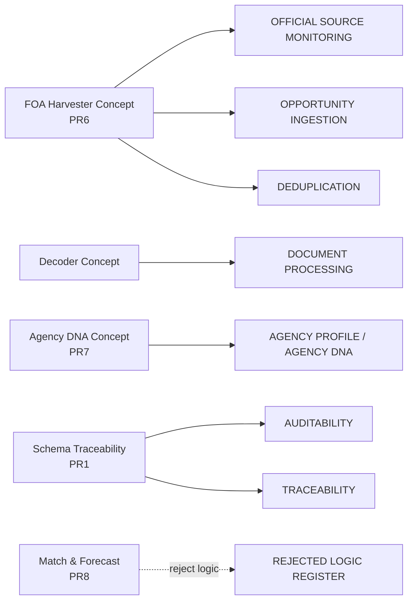

# Agent Dependency Graph (Initial Metadata-Only Version)

## 1) Claimed historical seven-agent dependency graph (from historical naming intent)

```mermaid
graph TD
  Sentinel[SENTINEL]\nsource monitoring --> Decoder[DECODER]\ndocument extraction
  Decoder --> Profiler[PROFILER]\nagency/funder profile
  Profiler --> Oracle[ORACLE]\nstrategic forecast
  Oracle --> Ranker[RANKER]\nprioritization
  Ranker --> Strategist[STRATEGIST]\nexecution planning
  Strategist --> Learner[LEARNER]\noutcome feedback
  Learner --> Sentinel
```

## 2) Actually proven executable dependency graph (this initial evidence pack)

```mermaid
graph TD
  Meta[GitHub API metadata evidence]\nrepos + PRs --> Docs[docs/agent-assets evidence pack]
  PR1[FRB PR #1 head SHA] --> Meta
  PR2[FRB PR #2 head SHA] --> Meta
  PR3[FRB PR #3 head SHA] --> Meta
  PR4[FRB PR #4 head SHA] --> Meta
  PR5[FRB PR #5 head SHA] --> Meta
  PR6[FRB PR #6 head SHA] --> Meta
  PR7[FRB PR #7 head SHA] --> Meta
  PR8[FRB PR #8 head SHA] --> Meta
```

Current proof status: agent-to-agent executable imports/calls are **NOT VERIFIED** in this initial metadata-only pass.

## 3) Proposed selective capability mapping into Manus runtime



## Text summary
- Claimed seven-agent chain exists only as **claim-level topology** in this snapshot.
- Executable dependency links are unproven until source-level import/call-graph extraction is completed.
- Selective integration should start with FOA/source monitoring concepts, then decoding, then profile enrichment; predictive probability logic remains prohibited.
