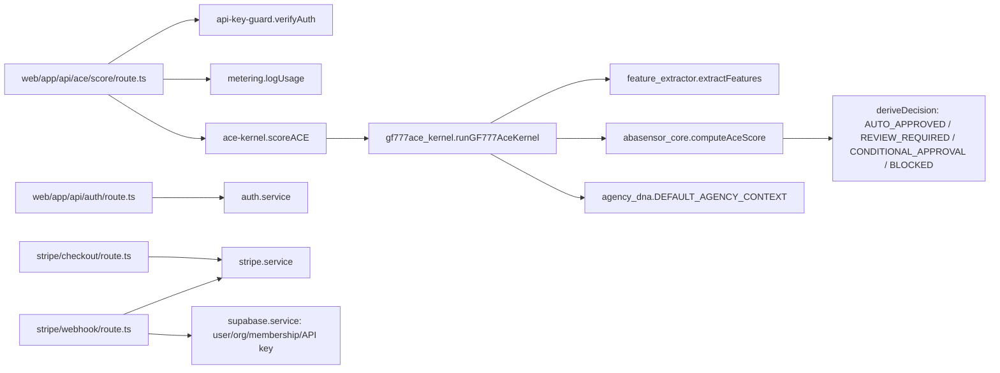
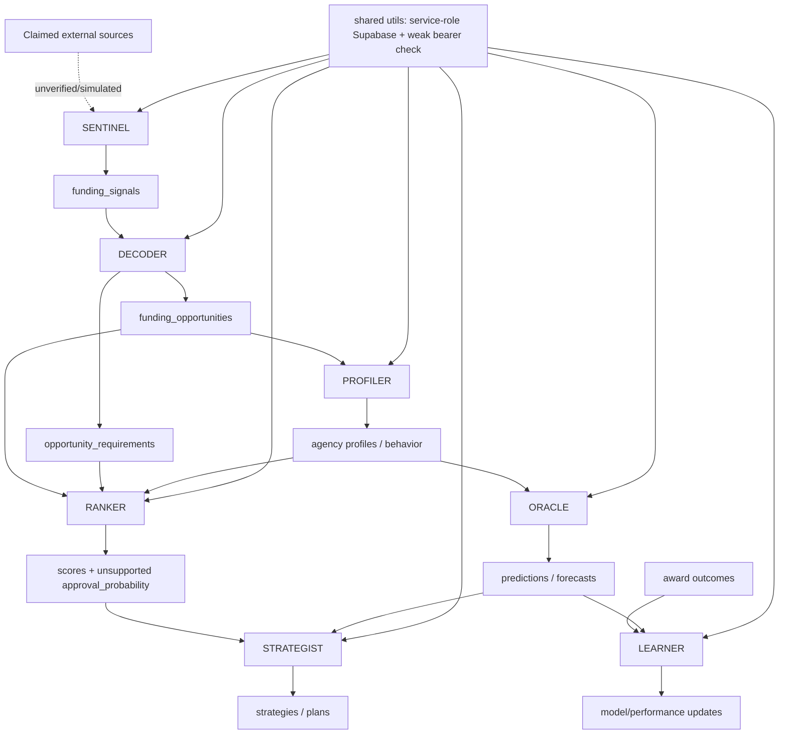
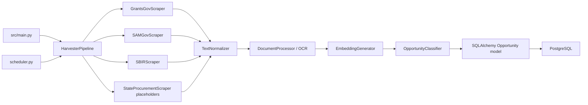
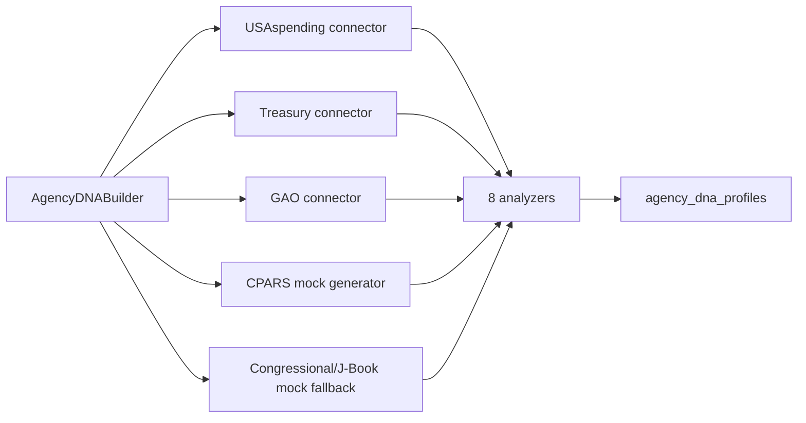
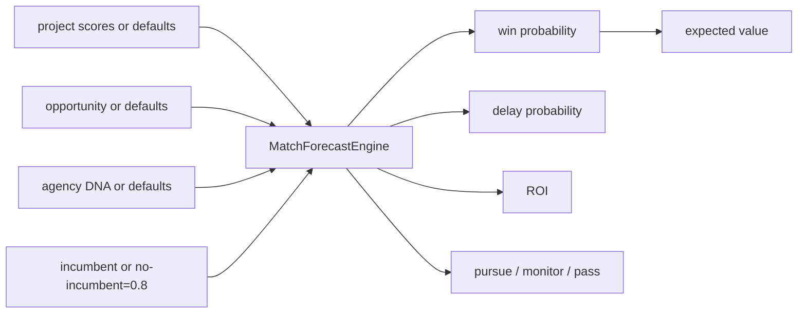
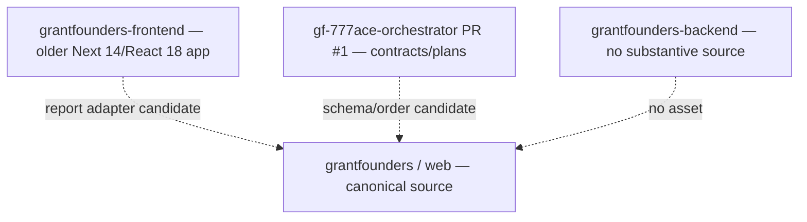

# Agent and System Dependency Graph

This graph records static source relationships. An arrow does **not** prove deployed reachability.

## Canonical source graph — `BRAINBEHAVIOR/grantfounders @ 9074648...`

### Canonical trust observations

- Existing auth, organization, metering, Supabase, Stripe, dashboard, and report concerns form the target boundary.
- A historical package may not create a parallel version without an approved architectural decision record.
- `AUTO_APPROVED` and fixed Agency DNA are red trust nodes and must not be exported as government facts.

## Historical seven-agent graph — FRB PR #5

### Broken trust propagation

1. SENTINEL can create a success state without source evidence.
2. DECODER can create specific opportunity facts from unknown/default inputs.
3. PROFILER can relabel opportunity data and simulate source analysis.
4. ORACLE emits uncalibrated forecasts.
5. RANKER converts heuristic score to apparent approval probability.
6. STRATEGIST multiplies and operationalizes unsupported outputs.
7. LEARNER can validate circularly/constantly, making false confidence self-reinforcing.

Because downstream stages depend on upstream claims, selective reuse must begin with source/provenance plumbing, not forecasting or strategy.

## FOA Harvester graph — FRB PR #6

Direct incompatibilities with the canonical target include Python execution, SQLAlchemy models, PostgreSQL ARRAY, `create_all`, and a separate opportunities schema. Concepts may be reimplemented only after target-contract verification.

## Agency DNA graph — FRB PR #7

Observed and generated records are not sufficiently separated. Output trust is therefore broken even where one connector performs a real request.

## Match & Forecast graph — FRB PR #8

Every derived financial/recommendation output is blocked because its upstream probability and defaults are unvalidated.

## Separate repositories

No dotted edge is an approved integration.

## Integration boundary

A package can cross into the canonical repository only when `07_MANUS_INTEGRATION_MANIFEST.json` has `integrationGate.status == "APPROVED"` and the package appears in `integrationOrder`. Candidate order alone grants no authority.
